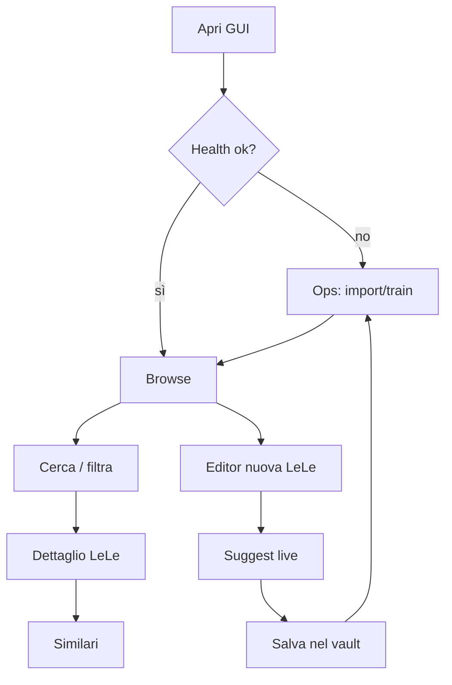

# LeLe Manager — GUI Design (Fase 0)

> **Status:** approvato per implementazione Fase 1 (GUI-alpha)  
> **Epic:** [#95](https://github.com/gcomneno/lele-manager/issues/95)  
> **Issue:** [#96](https://github.com/gcomneno/lele-manager/issues/96)  
> **Milestone:** [v2.0](https://github.com/gcomneno/lele-manager/milestone/3)  
> **Data:** 2026-07-05

---

## 1. North star

Aprire LeLe Manager in browser, esplorare il vault, scrivere una LeLe vedendo suggerimenti simili in tempo reale, salvare nel vault e riallineare il modello — **senza terminale**.

La GUI è **client dell'API FastAPI**. CLI (`lele`) e script shell restano il percorso power-user.

---

## 2. Information architecture

### Layout shell (tutte le schermate)

```
┌──────────────────────────────────────────────────────────────────────────┐
│  🐒 LeLe Manager          [🔍 Cerca...]              ● API  ● Model  ⚙️  │
├────────────┬─────────────────────────────────────────────────────────────┤
│            │                                                             │
│  NAV       │                    CONTENT AREA                             │
│            │                                                             │
│  Browse    │                                                             │
│  Editor    │                                                             │
│  Vault     │                                                             │
│  Ops       │                                                             │
│  ─────     │                                                             │
│  Timeline* │                                                             │
│  Stats*    │                                                             │
│            │                                                             │
└────────────┴─────────────────────────────────────────────────────────────┘
  * placeholder fase 3+ (#89, #88)
```

- **Sidebar fissa** (collassabile su mobile): navigazione primaria.
- **Header**: ricerca globale rapida + indicatori health (dataset, modello).
- **Content area**: una vista alla volta (no SPA overload con 10 tab).

### Mappa viste

| Vista | Route (client) | Scopo |
|-------|----------------|-------|
| Browse | `/` | Lista + filtri + selezione LeLe |
| Detail | `/lesson/:id` | Lettura completa + similari |
| Editor | `/editor` `/editor/:id` | Scrittura + frontmatter + suggest live |
| Vault | `/vault` | Albero cartelle vault (read-only in alpha) |
| Ops | `/ops` | Import, train, refresh, log |
| Timeline | `/timeline` | Fase 3 — #89 |
| Stats | `/stats` | Fase 3 — #88 |

### Cosa resta solo CLI

| Azione | Motivo |
|--------|--------|
| Automazione in CI / altri repo | API/CLI più adatte |
| Batch script su migliaia di file | `import_from_dir` con flag avanzati |
| Debug ML / pipeline sklearn | dev tooling |
| `lele suggest --watch` in pipe shell | power user |

---

## 3. Wireframe (bassa fedeltà)

### 3.1 Browse (Home)

```
┌─ Filtri ─────────────────────────────────────────────────────────────────┐
│ q: [ pytest src layout_______________ ]  topic: [python ▼]  source: [all]│
│ importance: [1]──●────────[5]   limit: [20]              [ Cerca ] [Reset]│
└──────────────────────────────────────────────────────────────────────────┘

┌─ Risultati (42) ─────────────────────────────────────────────────────────┐
│ ┌────────────────────────────────────────────────────────────────────────┐ │
│ │ ● python · importance 4 · chatgpt · 2025-11-20                        │ │
│ │ Con layout src/ devo configurare PYTHONPATH o usare un conftest...    │ │
│ └────────────────────────────────────────────────────────────────────────┘ │
│ ┌────────────────────────────────────────────────────────────────────────┐ │
│ │ ○ git · importance 5 · note · 2025-12-05                              │ │
│ │ Architettura locale/remoto: branch strategy per feature isolate...      │ │
│ └────────────────────────────────────────────────────────────────────────┘ │
│ ...                                                                        │
└────────────────────────────────────────────────────────────────────────────┘

Click riga → Detail    [ + Nuova LeLe ] → Editor
```

**API:** `POST /lessons/search`, fallback `GET /lessons`

---

### 3.2 Dettaglio LeLe

```
┌─ python/2025-11-20.pytest-src-layout ──────────────────── [ Modifica ] [✕]┐
│ topic: python   source: chatgpt   importance: ████░ 4   date: 2025-11-20   │
│ tags: [python] [pytest] [tooling]                                            │
├──────────────────────────────────────────────────────────────────────────────┤
│                                                                              │
│  # LL — pytest con src layout                                                │
│                                                                              │
│  Con layout `src/` devo configurare PYTHONPATH o usare un `conftest`        │
│  per far trovare i moduli a pytest senza hack sul cwd.                       │
│                                                                              │
├─ Simili (GET /lessons/{id}/similar) ───────────────────────────────────────┤
│  0.87  git/2025-12-01.monorepo-testing                                       │
│  0.72  python/2025-10-15.venv-paths                                          │
│  0.61  tooling/2025-09-03.editable-install                                     │
└──────────────────────────────────────────────────────────────────────────────┘
```

**API:** `GET /lessons/{id}`, `GET /lessons/{id}/similar?explain=true`

---

### 3.3 Editor (core UX)

```
┌─ Editor ──────────────────────────────── [ Salva ] [ Anteprima ] [ Annulla ]─┐
│ id:      [ python/2025-07-05.new-lesson_________ ]  (auto se nuova)         │
│ topic:   [ python ▼]  source: [ note ▼]  importance: [3]  date: [2026-07-05]│
│ tags:    [ pytest, tooling________________________________________ ]         │
├──────────────────────────────┬───────────────────────────────────────────────┤
│ FRONTMATTER + MARKDOWN       │  SIMILI LIVE (POST /editor/suggest)          │
│                              │                                               │
│ ---                          │  Mentre scrivi...                             │
│ title: "..."                 │                                               │
│ ---                          │  0.84  pytest src layout conftest             │
│                              │  0.71  PYTHONPATH editable install            │
│ Quando uso layout src/ ...   │  0.55  uv vs pip venv                         │
│                              │                                               │
│                              │  [top_k: 5] [min_score: 0.1]  debounce 500ms  │
└──────────────────────────────┴───────────────────────────────────────────────┘
```

**Comportamento suggest:** debounce 500 ms sull'editor; chiama `/editor/suggest` (non `/similar` diretto — semantica editor).

**Salvataggio (fase 2):** `PUT` + write-back vault. In **fase 1 alpha** il bottone Salva può essere disabilitato con tooltip “fase 2”.

---

### 3.4 Vault (navigazione)

```
┌─ Vault: ~/Uploads/LeLe-Vault ─────────────────────────── [ Importa ora ] ────┐
│ ▼ python/                                                                   │
│   ├─ 2025-11-20.pytest-src-layout.md                                        │
│   └─ 2025-10-15.venv-paths.md                                               │
│ ▼ git/                                                                      │
│   └─ 2025-12-05.architettura-locale-remoto.md                               │
│ ▶ cpp/                                                                      │
│ ▶ linux/                                                                    │
└─────────────────────────────────────────────────────────────────────────────┘

Click file → Detail    Right-click → Apri in Editor (fase 2)
```

**API fase 1:** stub con lista piatta da `GET /lessons` raggruppata per `topic`.  
**API fase 2:** `GET /vault/tree` (vero filesystem).

---

### 3.5 Ops / Admin

```
┌─ Operazioni ───────────────────────────────────────────────────────────────┐
│                                                                              │
│  Health                                                                      │
│  ├─ API ............... ● ok                                                 │
│  ├─ Dataset ........... ● lessons.jsonl (128 righe)                          │
│  └─ Topic model ......... ● topic_model.joblib (2026-07-05 09:12)              │
│                                                                              │
│  ┌─────────────────┐  ┌─────────────────┐  ┌─────────────────────────────┐  │
│  │ Import vault    │  │ Train topic     │  │ Refresh completo            │  │
│  │ POST /vault/    │  │ POST /train/    │  │ import + train              │  │
│  │      import     │  │      topic      │  │ (wrap script refresh)       │  │
│  └─────────────────┘  └─────────────────┘  └─────────────────────────────┘  │
│                                                                              │
│  Log ultima operazione:                                                      │
│  ┌────────────────────────────────────────────────────────────────────────┐  │
│  │ [10:01:02] import ok — 128 lessons                                     │  │
│  │ [10:01:05] train ok — accuracy 0.91                                    │  │
│  └────────────────────────────────────────────────────────────────────────┘  │
└──────────────────────────────────────────────────────────────────────────────┘
```

**API oggi:** `GET /health`, `POST /train/topic`  
**API nuove:** `POST /vault/import`, `POST /ops/refresh` (vedi §5)

---

### 3.6 Timeline / Stats (placeholder fase 3)

```
Timeline (#89)                    Stats (#88)
┌──────────────────────┐          ┌──────────────────────┐
│ 2026-07 ●●           │          │ per topic: ████ python│
│ 2026-06 ●            │          │            ██ git     │
│ 2025-12 ●●●          │          │ avg importance: 3.4  │
└──────────────────────┘          └──────────────────────┘
```

Non bloccano GUI-alpha.

---

## 4. Flussi utente principali



### Flusso 1 — Esplorare
1. Browse → filtri → click risultato  
2. Detail → leggi markdown + similari  
3. (Opz.) “Modifica” → Editor  

### Flusso 2 — Scrivere
1. Editor → compila frontmatter + body  
2. Pannello destro aggiorna similari ogni 500 ms  
3. Salva (fase 2) → write-back `.md` → Ops refresh  

### Flusso 3 — Allineare dati
1. Ops → Import vault → Train → (opz.) Refresh completo  
2. Health torna verde  

---

## 5. Gap API — priorità

### Blocker per GUI-alpha (Fase 1)

| Endpoint | Metodo | Scopo | Workaround alpha |
|----------|--------|-------|------------------|
| — | — | Nessun blocker critico | API esistenti sufficienti per browse/detail/similar |

La GUI-alpha può usare solo API già presenti:
- `GET /health`
- `GET /lessons`, `POST /lessons/search`
- `GET /lessons/{id}`
- `GET /lessons/{id}/similar`
- `POST /similar`, `POST /editor/suggest`
- `POST /train/topic`

### Necessari per Fase 2 (Editor + vault write-back)

| Endpoint | Metodo | Priorità | Note |
|----------|--------|----------|------|
| `/vault/tree` | GET | P1 | Albero reale `LELE_VAULT_DIR` |
| `/vault/import` | POST | P1 | Wrap `import_from_dir` + opzioni |
| `/lessons/{id}` | PUT | P1 | Aggiorna record + write-back `.md` |
| `/lessons` | POST | ✅ | Esiste; estendere per create-on-vault |
| `/vault/lessons` | POST | P1-alt | Crea nuovo file `.md` nel vault |

### Necessari per Fase 2 Ops (comodo ma non blocker)

| Endpoint | Metodo | Priorità | Note |
|----------|--------|----------|------|
| `/ops/refresh` | POST | P2 | import + train in un colpo |
| `/ops/import/status` | GET | P3 | Job async se import lungo |

### Fase 3+

| Endpoint | Issue correlata | Stato |
|----------|-----------------|-------|
| `/stats/summary` | #88 | ✅ v1.8.0 |
| `/stats/timeline` | #89 | ✅ v1.8.0 |
| `/export/search` | #87 | ✅ v1.9.0 |
| `explain=true` su similarità | #90 | ✅ v1.9.0 |
| `/lessons/duplicates` | #85 | Fase 5 |

### Real-time suggest

| Opzione | Pro/contro | Decisione |
|---------|------------|-----------|
| Polling `POST /editor/suggest` | Semplice, già funziona | **✅ Fase 1** |
| SSE/WebSocket | Meno richieste, più infra | Fase 3 se serve |

---

## 6. Scelta stack frontend

### Tabella comparativa

| Criterio | A. Vite+Svelte SPA | B. HTMX+Jinja | C. PySide6 | D. Tauri+SPA |
|----------|-------------------|---------------|------------|--------------|
| Time-to-MVP | ⭐⭐⭐⭐ | ⭐⭐⭐⭐⭐ | ⭐⭐ | ⭐⭐ |
| Manutenibilità (1 dev) | ⭐⭐⭐⭐⭐ | ⭐⭐⭐⭐ | ⭐⭐⭐ | ⭐⭐⭐ |
| Integrazione FastAPI | ⭐⭐⭐⭐⭐ | ⭐⭐⭐⭐⭐ | ⭐⭐ | ⭐⭐⭐⭐ |
| Editor markdown ricco | ⭐⭐⭐⭐⭐ | ⭐⭐ | ⭐⭐⭐ | ⭐⭐⭐⭐⭐ |
| State client (suggest live) | ⭐⭐⭐⭐⭐ | ⭐⭐⭐ | ⭐⭐⭐⭐ | ⭐⭐⭐⭐⭐ |
| Path desktop app | ⭐⭐⭐⭐ | ⭐ | ⭐⭐⭐⭐⭐ | ⭐⭐⭐⭐⭐ |
| Bundle size | ⭐⭐⭐⭐⭐ | ⭐⭐⭐⭐⭐ | N/A | ⭐⭐⭐⭐ |
| Ecosistema componenti | ⭐⭐⭐⭐ | ⭐⭐ | ⭐⭐⭐ | ⭐⭐⭐⭐ |

### Decisione: **A — Vite + Svelte 5 SPA**

**Motivazione:**
1. Evolve naturalmente il PoC `ui.html` (fetch verso stessi endpoint).
2. Bundle leggero, curva di apprendimento bassa per single maintainer.
3. Build statico (`frontend/dist/`) servito da FastAPI — zero nuovo runtime.
4. Tauri (fase 5) può embeddare la stessa SPA senza riscrittura.
5. HTMX insufficiente per editor split-pane + debounce suggest + anteprima markdown.
6. PySide6 introdurrebbe secondo stack UI da mantenere.

**Stack dettagliato Fase 1:**

| Layer | Scelta |
|-------|--------|
| Build | Vite 6 |
| UI framework | Svelte 5 |
| Routing | svelte-spa-router o SvelteKit (static adapter) |
| HTTP | `fetch` nativo (come `ui.html`) |
| Markdown render | `marked` + `dompurify` |
| Markdown edit | `codemirror` o textarea styled (MVP) |
| CSS | CSS variables + layout grid (no heavy UI lib in alpha) |
| Test E2E | Playwright (fase 1b) |

**Struttura directory proposta:**

```
lele-manager/
  frontend/                 # nuovo — Vite + Svelte
    src/
      lib/api.ts            # client API tipizzato
      routes/               # Browse, Detail, Editor, Ops
      components/           # LessonCard, SimilarPanel, HealthBar
    package.json
    vite.config.ts
  src/lele_manager/
    api/server.py           # serve /app/* static + fallback SPA
    gui/                    # opzionale: dist copiata in wheel
```

**Serving:** FastAPI monta `StaticFiles` su `/app` e redirect `/` → `/app/` (o sostituisce `/ui` deprecato).

---

## 7. Fuori scope (fase 0–1)

- Multi-utente, auth, permessi
- Cloud sync
- Sostituire Obsidian
- LLM / RAG
- Design system completo / dark mode (nice-to-have fase 2)
- Desktop installer (Tauri — fase 5)
- Write-back vault (fase 2)

---

## 8. Piano implementazione Fase 1 (GUI-alpha)

| Step | Task | Stima |
|------|------|-------|
| 1.1 | Scaffold `frontend/` (Vite+Svelte) | 2h |
| 1.2 | `api.ts` client + HealthBar | 1h |
| 1.3 | Vista Browse + filtri | 3h |
| 1.4 | Vista Detail + similari | 2h |
| 1.5 | Vista Editor read-only + suggest live | 3h |
| 1.6 | Vista Ops (health + train) | 2h |
| 1.7 | FastAPI static mount + deprecate `/ui` | 1h |
| 1.8 | Smoke Playwright (browse → detail) | 2h |

**Totale indicativo:** ~16h (2 giornate concentrate).

---

## 9. Criteri di accettazione Fase 0 ✅

- [x] Wireframe 5 schermate core
- [x] Information architecture documentata
- [x] Stack scelto con tabella pro/contro
- [x] Gap API prioritizzati
- [x] `docs/gui-design.md` nel repo
- [ ] Issue Fase 1 aperta → vedi [#97](https://github.com/gcomneno/lele-manager/issues/97) *(da creare)*

---

## 10. Riferimenti

- PoC attuale: `src/lele_manager/api/ui.html` → `GET /ui`
- Epic GUI: [#95](https://github.com/gcomneno/lele-manager/issues/95)
- Milestone: [v2.0](https://github.com/gcomneno/lele-manager/milestone/3)
- Issue correlate: #88, #89, #87, #90, #85, #84, #92

---

## 11. Fase 4 — Explain, export, E2E ✅ (v1.9.0)

| Blocco | Deliverable | Note |
|--------|-------------|------|
| 4.1 Explain | Pannello **“Perché simile?”** in Detail/Editor | `explain=true`: rank, topic, tag overlap, meta query |
| 4.2 Export | `POST /export/search` + **Esporta .md** in Browse | Frontmatter YAML opzionale; export bucket in Timeline |
| 4.3 E2E | Playwright smoke (3 test) | CI job `e2e`; `scripts/e2e-serve.sh` + fixture `.e2e-fixture/` |
| 4.4 Release | CHANGELOG + bump `1.9.0` | Milestone GUI v2.0 — epic #95 |

### Wireframe aggiornamenti

**Detail / Editor — pannello destro:**
```
┌─ Perché simile? ─────────────────┐
│ top_k=5, min_score=0.10           │
│ #1  0.84  python                  │
│ python/2025-01-01.slug            │
│ tag in comune: pytest             │
└───────────────────────────────────┘
```

**Browse — azioni:**
```
[Cerca] [Lista tutte] [Esporta .md] [Reset]
```

### CLI Fase 4

```bash
lele similar <id> --explain
lele suggest --text "..." --explain
lele export --search "pytest" --topic python -o results.md
```
