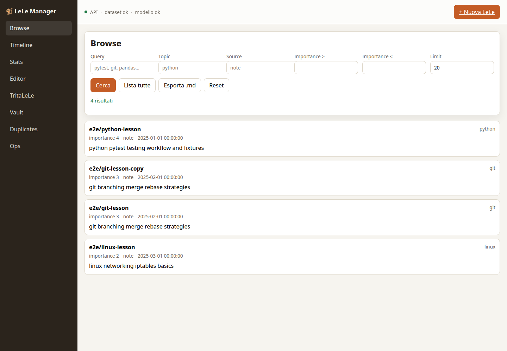
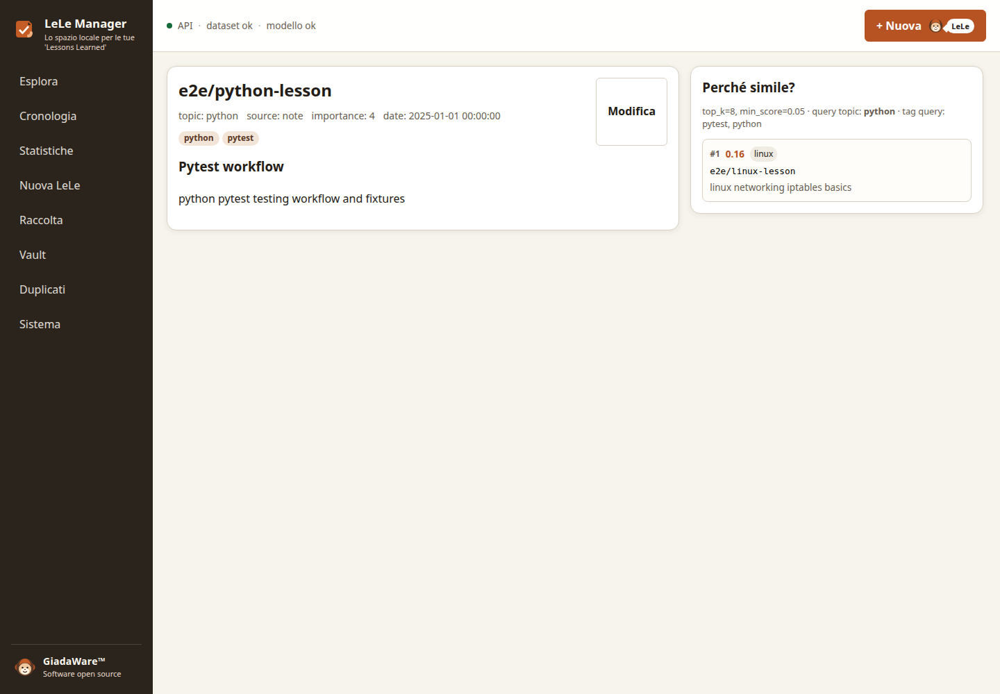
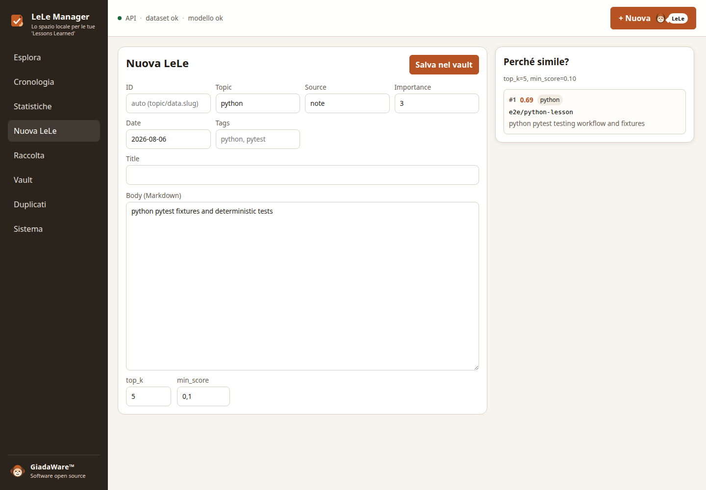
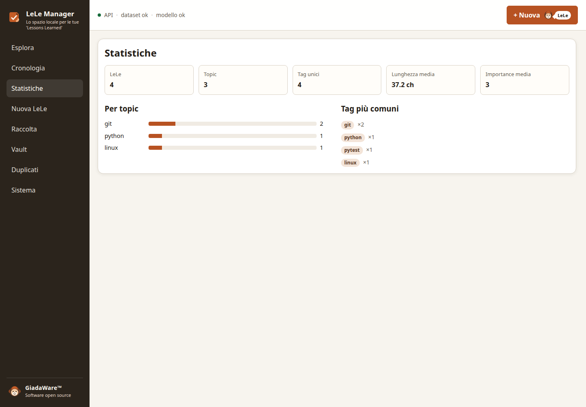
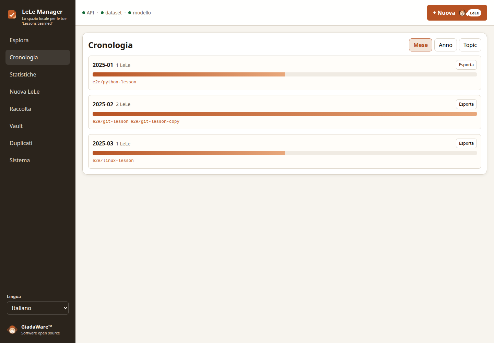
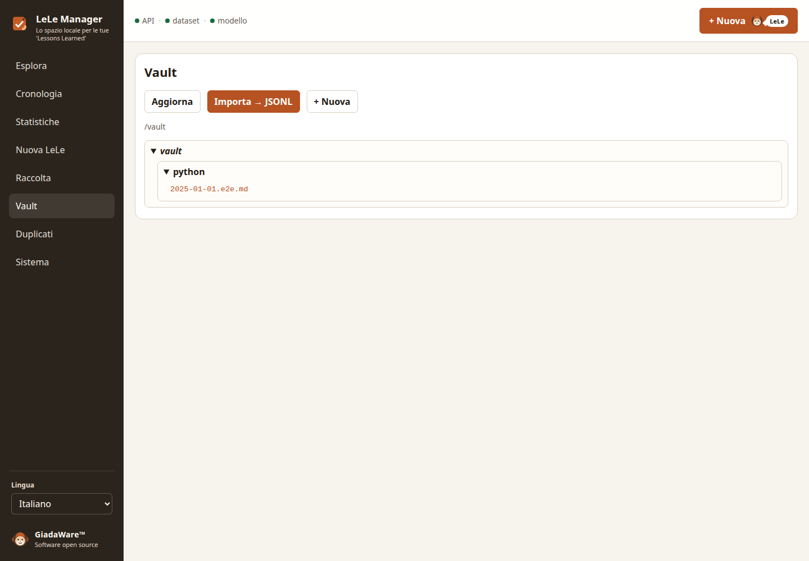
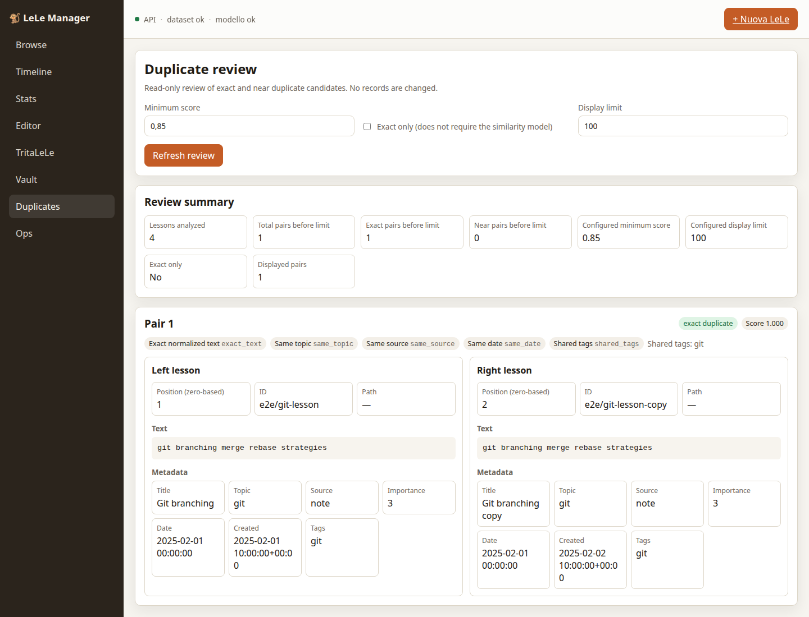
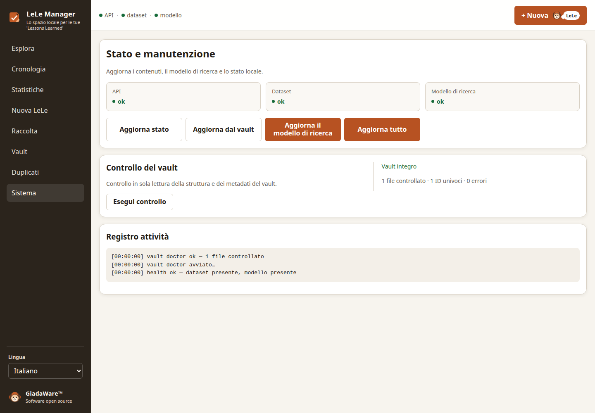
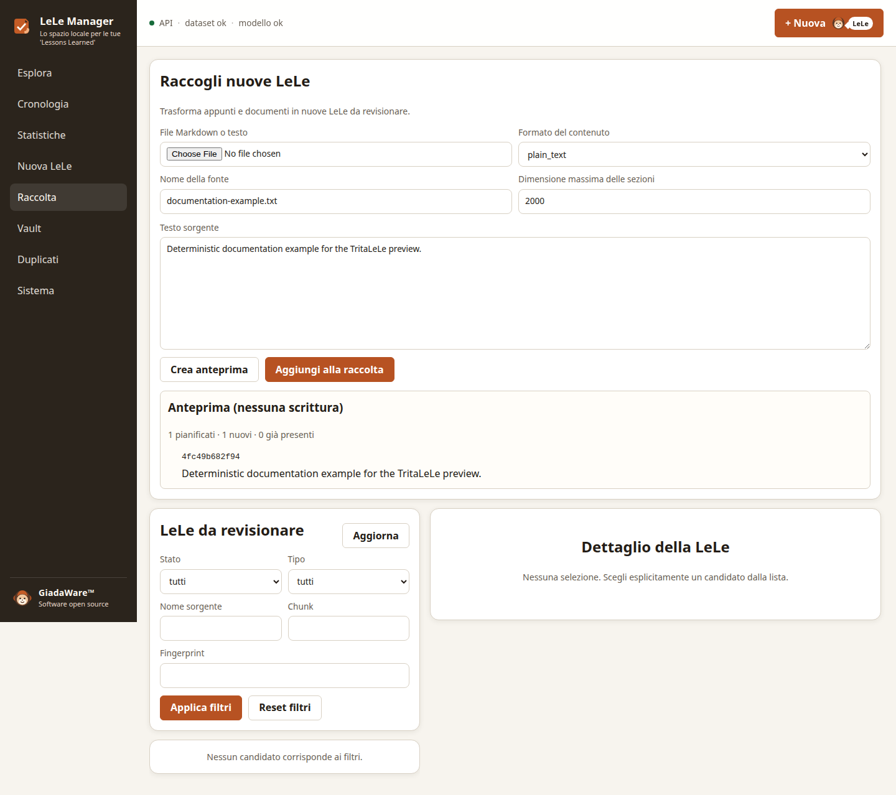

# Manuale della GUI di LeLe Manager

[English](../gui-user-guide.md) | [Italiano](gui-user-guide.md)

> Stato: documentazione utente mantenuta
> Issue correlata: [#112](https://github.com/gcomneno/lele-manager/issues/112)

Questa guida documenta la GUI web locale rilasciata. Il record storico di
design resta disponibile in [`../gui-design.md`](../gui-design.md).

## Avviare la GUI

Per il normale utilizzo del prodotto installato, scaricare ed estrarre il
pacchetto nativo per Linux, macOS o Windows e avviare **LeLe-Manager** dalla
directory `LeLe-Manager` estratta. Non servono Python, Node.js, npm, ambiente
virtuale, build del frontend o checkout del repository. Il launcher packaged
prepara le directory runtime locali, avvia l'applicazione su loopback, attende
`/health` e apre automaticamente `/app/`.

L'archive Linux supporta anche un'installazione locale esplicita: eseguire
`./install.sh` dalla sua directory principale e poi il launcher stabile
`lele-manager` da `~/.local/bin` (o dalla directory bin personalizzata
documentata). L'archive estratto resta utilizzabile in modo portabile.
L'installazione non aggiunge ancora una voce nel menu applicazioni o un'icona.
L'installer gestisce solo
`${XDG_DATA_HOME:-~/.local/share}/lele-manager/install/`; la directory
`lele-manager` circostante resta lo spazio dei dati runtime persistenti.

Ogni archive nativo include `LEGGIMI_PRIMA.txt` con istruzioni di primo avvio
specifiche per la piattaforma.

Per lo sviluppo da checkout del repository usare:

```bash
export LELE_VAULT_DIR="$HOME/LeLeVault"
./scripts/build-gui.sh
./scripts/lele-api-dev.sh
```

Quindi aprire:

```text
http://127.0.0.1:8000/app/
```

Usare `scripts/lele-api-refresh.sh` quando occorre prima importare il vault
Markdown e riaddestrare il modello topic.

## Lingua della GUI

LeLe Manager parte in **inglese** quando non è memorizzata una scelta esplicita
della lingua. Il selettore si trova nell’header globale sempre raggiungibile.
Le lingue mantenute della GUI sono **English** e **Italiano**.

Il cambio di lingua aggiorna immediatamente la GUI senza ricaricare la pagina.
La scelta esplicita viene conservata localmente nel browser con la chiave
`lele-manager.locale`. Valori memorizzati mancanti, malformati o non
supportati ricadono in sicurezza sull'inglese; il rilevamento automatico della
lingua del browser è intenzionalmente assente.

La localizzazione riguarda soltanto la presentazione della GUI. Non traduce né
modifica LeLe scritte dall'utente, contenuto Markdown del vault, valori del
dataset, topic, fonti, percorsi, ID, payload API o identità di navigazione.

## Shell applicativa

L’header globale contiene contesto e utilità dell’applicazione: nome dello
spazio di lavoro corrente, stato compatto di API/dataset/modello di ricerca,
controllo della lingua, **Cerca o comandi** e **Aiuto**. Non contiene
deliberatamente azioni di pagina quali Salva, Elimina, refresh del modello o
una CTA permanente di creazione. Versione e identità completa del prodotto
restano autorevoli in **Informazioni**.

Usa il pulsante di navigazione nell’header per mostrare o nascondere l’intera
sidebar. Questa preferenza è conservata localmente come
`lele-manager.sidebar-visible.v1` ed è indipendente dai gruppi comprimibili
**Conoscenza**, **Acquisizione** e **Gestione**. Nascondere la sidebar non
rimuove i controlli dell’header; quando la riapri, disclosure dei gruppi e
destinazione corrente restano preservate.

Usa **Cerca o comandi** o **Ctrl+K** per aprire rapidamente destinazioni reali,
incluse Dashboard, Esplora, Cronologia, Statistiche, Raccolta, Vault,
Duplicati, Sistema, Diagnostica, Informazioni e **Nuova LeLe**. La ricerca di
LeLe apre Esplora e non crea un secondo sistema di ricerca. **Nuova LeLe**
resta sotto **Acquisizione** nella navigazione ed è disponibile anche come
comando esplicito.

**Aiuto** offre guida utente, Diagnostica, il modulo GitHub mantenuto per le
segnalazioni bug, Informazioni e il promemoria della scorciatoia. Non genera né
invia dati diagnostici. Su schermi stretti l’header resta disponibile sopra una
navigazione recuperabile ed evita overflow orizzontale.

## Flusso quotidiano

1. Aprire **Dashboard** per vedere disponibilità dello spazio di lavoro, punti
   che richiedono attenzione e prossima azione utile.
2. Usare **Ops** quando servono diagnostica esplicita, import, training o refresh.
3. Cercare, filtrare e leggere le lesson esistenti.
4. Creare o modificare lesson approvate tramite **Editor**.
5. Revisionare duplicati esatti e near-duplicate tramite **Duplicates**.
6. Ingerire appunti grezzi tramite **TritaLeLe**, mantenendo separate anteprima,
   staging, revisione e approvazione.
7. Usare **Vault**, **Stats** e **Timeline** per controllare la knowledge base.
8. Usare **Diagnostica** per controllare lo stato di assistenza e preparare un
   rapporto bounded; usare **Informazioni**
   per identità del prodotto, licenza e collegamenti di supporto.

## Viste della GUI

| Vista | Scopo |
|---|---|
| Dashboard | Disponibilità dello spazio di lavoro, riepiloghi bounded e prossime azioni utili |
| Browse | Ricerca, filtri ed esportazione delle lesson |
| Detail | Lettura di una lesson e similarità spiegata |
| Editor | Creazione o aggiornamento di lesson Markdown canoniche |
| Timeline | Analisi per mese, anno o topic |
| Stats | Conteggi, topic, tag e valori medi |
| TritaLeLe | Anteprima, staging, revisione e approvazione esplicita |
| Vault | Albero Markdown canonico e import della proiezione |
| Duplicates | Revisione non distruttiva di duplicati e near-duplicate |
| Ops | Health, Vault Doctor, import, training e refresh |
| Diagnostica | Stato per l’assistenza, pacchetto diagnostico bounded esplicito e percorsi runtime |
| Informazioni | Identità prodotto, versione, licenza, dichiarazione local-first e collegamenti di supporto |

## Dashboard e stati di primo avvio

`/app/` apre la Dashboard. Browse resta disponibile direttamente su
`#/browse`.

La Dashboard legge soltanto uno stato bounded dello spazio di lavoro. Distingue
un primo avvio senza vault, un vault vuoto, uno spazio parzialmente pronto, uno
spazio pronto ed errori di caricamento recuperabili. Non avvia automaticamente
la revisione duplicati, Vault Doctor, import, refresh o training del modello.

Il vault Markdown resta la fonte autorevole. Proiezioni dataset, cache e
artefatti del topic model sono derivati e ricostruibili.

## Diagnostica, Informazioni e passaggio all’assistenza

**Diagnostica** è read-only. Inizia con lo stato di API, dataset, modello di
ricerca e versione di LeLe Manager. Genera esplicitamente un rapporto bounded,
ispeziona l’anteprima, quindi usa Copia JSON o Scarica JSON; entrambe le azioni
usano l’identico testo dell’anteprima.

**Richiedi assistenza** apre deliberatamente il modulo GitHub di segnalazione
bug mantenuto. Non genera, carica né trasmette dati diagnostici. Esamina
`lele-manager-diagnostics-<version>.json` e decidi se allegarlo.

**Dettagli tecnici** è chiuso per default e mantiene percorsi runtime effettivi,
ruoli semantici, esistenza, provenienza e azioni Copia percorso. Il pacchetto
diagnostico esclude contenuti di lesson e candidati, segreti, credenziali,
token, cookie, header di autorizzazione, variabili d’ambiente arbitrarie,
filesystem estraneo e inventari ampi di processi o sistema.

**Informazioni** usa la stessa versione autorevole mostrata dal product shell.
Espone attribuzione GiadaWare, licenza MIT con riferimento completo incorporato,
repository, issue tracker, release, changelog e documentazione, oltre alla
dichiarazione local-first. LeLe Manager non introduce account, telemetria,
storage cloud o servizi remoti per la knowledge base.

## Scrittura dei metadati

L’Editor carica suggerimenti locali in sola lettura per topic, tag e fonti
conosciuti dalla proiezione corrente delle lesson. Sono una comodità: puoi
scrivere un nuovo topic, tag o fonte e i suggerimenti non modificano mai i
metadati automaticamente. I tag sono chip visibili da aggiungere o rimuovere e
l’Importanza è esplicitamente limitata da 1 a 5. La similarità può proporre un
topic solo dopo una verifica esplicita; applicarlo richiede un’azione distinta.
Solo il salvataggio scrive nel vault Markdown canonico.

## Gestire una LeLe esistente

Browse e Dettaglio della lesson espongono le stesse azioni per una LeLe
esistente: **Modifica**, **Ispeziona** ed **Elimina**. Ispeziona apre la
superficie mantenuta di similarità spiegata; durante la modifica, Editor
mantiene l’azione esplicita **Verifica similarità**. Elimina mostra sempre il
titolo della lesson (oppure *Senza titolo*) e l’ID stabile per la conferma,
prima di rimuovere permanentemente quel preciso file Markdown canonico.

Browse supporta anche la selezione multipla esplicita dello snapshot dei
risultati caricati. **Seleziona tutte le LeLe visibili** seleziona solo i
risultati attualmente renderizzati e limitati; non seleziona mai lesson
nascoste, non caricate o altre corrispondenze del vault/della ricerca. Una nuova
esecuzione di Cerca o Lista tutte cancella la selezione, anche se alcuni ID sono
comuni, e richiede di selezionare di nuovo i target. **Elimina selezionate**
mostra titolo e ID stabile di ogni target prima della conferma. Elimina quelle
fonti Markdown canoniche e aggiorna la proiezione derivata una sola volta per
l’intero batch. Errori canonici per target e un errore finale di refresh
derivato sono comunicati separatamente; le eliminazioni canoniche riuscite
restano tali. Ispeziona selezione è intenzionalmente rimandato: le API di
similarità mantenute non definiscono un contratto non ambiguo per un sottoinsieme
selezionato. La risoluzione delle coppie duplicate resta un workflow separato.

Dopo una normale eliminazione LeLe Manager ricostruisce automaticamente la
proiezione e lo stato di ricerca derivati: non è necessario usare
**Sistema → Aggiorna tutto**. Se l’eliminazione Markdown riesce ma il refresh
derivato fallisce, l’interfaccia comunica correttamente l’esito parziale: la
LeLe canonica non esiste più, mentre ricerca e similarità possono restare
temporaneamente obsolete fino a un refresh successivo.

## Screenshot

Gli screenshot in [`../images/gui/`](../images/gui/) sono generati dalla
fixture Playwright isolata. Non contengono vault o dati personali.

### Browse e dettaglio della lesson





### Scrittura e analisi







### Vault, operazioni e workflow di revisione





### Risolvere con consapevolezza le coppie candidate

Il rilevamento dei duplicati è solo informativo: non elimina, accorpa né
modifica automaticamente i metadati. Ogni coppia mantiene visibili entrambe le
fonti Markdown canoniche e offre azioni esplicite. Puoi aprire in modifica uno
dei due ID, mantenere una LeLe ed eliminare definitivamente l'altra dopo una
conferma che identifica entrambe, segnare **Non sono duplicati** oppure aprire
**Accorpa**.

**Non sono duplicati** è stato applicativo locale persistente, non metadato
Markdown. Nasconde la coppia solo finché entrambe le LeLe conservano lo stesso
contenuto materiale: testo, titolo, topic, fonte, importanza, tag e data. Una
modifica materiale rende nuovamente revisionabile una coppia ancora rilevata.
Le decisioni sono al momento delimitate dal percorso risolto del vault; questo
limite temporaneo è isolato e verrà migrato a un'identità di vault registrata
nel futuro lavoro multi-vault.

L'accorpamento è un flusso di modifica controllato dall'utente. Scegli quale ID
esistente, sinistro o destro, resta, confronta entrambe le fonti in sola
lettura, modifica manualmente la LeLe risultante e conferma esplicitamente il
salvataggio e l'eliminazione dell'altra fonte. LeLe Manager non concatena in
automatico e non usa IA per sintetizzare un accorpamento.

Il Markdown è canonico. Eliminazione e accorpamento modificano prima le fonti
canoniche e poi aggiornano proiezione e ricerca derivate. Se tale aggiornamento
fallisce, l'interfaccia indica separatamente la realtà canonica e non finge un
rollback; quando opportuno aggiorna i dati derivati da Sistema.





## Modello dei dati e percorsi

LeLe Manager separa contenuto autorevole, dati applicativi persistenti e
artefatti ricostruibili.

| Livello | Default o configurazione | Ruolo | Priorità backup |
|---|---|---|---|
| Vault Markdown | `LELE_VAULT_DIR`, default `~/LeLeVault` | Autorità delle lesson approvate | Critica |
| Proiezione lesson | `LELE_DATA_DIR/lessons.jsonl` | Proiezione di lettura ricostruibile | Opzionale |
| Staging candidati | `LELE_DATA_DIR/candidates.json` | Stato TritaLeLe non approvato | Importante con revisioni pendenti |
| Modello topic | `LELE_CACHE_DIR/topic_model.joblib` | Artefatto ML ricostruibile | Opzionale |
| Percorso lesson legacy | `LELE_DATA_PATH` | Override file-level deprecato | Solo migrazione |
| Percorso modello legacy | `LELE_MODEL_PATH` | Override file-level deprecato | Solo migrazione |

Senza override di directory, dati applicativi e cache usano i percorsi del
sistema operativo determinati da `platformdirs`.

### Compatibilità degli script di sviluppo

La configurazione mantenuta usa `LELE_DATA_DIR` e `LELE_CACHE_DIR`. Gli script
di sviluppo attuali impostano ancora le variabili file-level deprecate
`LELE_DATA_PATH=data/lessons.jsonl` e
`LELE_MODEL_PATH=models/topic_model.joblib`, così le esecuzioni di sviluppo
restano locali al repository.

Questo comportamento di compatibilità è temporaneo. Nei servizi, nei launcher
personalizzati e nel packaging futuro vanno preferite le variabili
directory-level. Non impostare contemporaneamente la variabile directory-level
e il corrispondente override file-level legacy, salvo che l’override legacy sia
voluto esplicitamente.

## Backup e ripristino

Usa **Vault** per creare uno snapshot portabile di un Vault registrato scelto
esplicitamente. **Crea snapshot** scarica uno ZIP versionato senza cambiare il
Vault attivo. Include Markdown canonici, staging candidati e decisioni sui
duplicati di quel Vault; esclude registro globale, proiezione JSONL, cache di
similarità e modello topic.

Per ripristinare, scegli uno ZIP locale e una destinazione già registrata,
quindi usa **Valida e mostra anteprima del ripristino**. L'anteprima in sola
lettura identifica provenienza, UUID e percorso della destinazione e mostra
aggiunte, sostituzioni, rimozioni e file Markdown invariati. Il contratto del
Vault considera canonico ogni file `.md` sotto la radice (anche senza
frontmatter), quindi il ripristino esatto rimuove ogni Markdown di destinazione
assente dallo snapshot. I file non Markdown non correlati restano invariati.
Digita il nome effettivo del Vault di destinazione per la seconda conferma. Lo
ZIP viene validato completamente prima di scrivere: limiti di dimensione,
percorsi relativi sicuri, checksum e nessun membro cifrato, link o percorso
sorgente/destinazione non sicuro.

La destinazione conserva UUID di registro, nome visualizzato, percorso e stato
attivo anche per uno snapshot proveniente da un altro Vault. Candidati e
decisioni sono ripristinati solo nel relativo scope. Al successo LeLe Manager
ricostruisce la proiezione, invalida la similarità ed elimina un vecchio modello
topic. Se l'aggiornamento derivato fallisce, la GUI dichiara esplicitamente il
successo canonico e segnala che i dati derivati richiedono attenzione. Un
artefatto, Markdown, candidati, decisioni sui duplicati o Vault selezionato
modificati rendono obsoleta l'anteprima e richiedono una nuova anteprima. In
caso di errore canonico/editoriale viene tentato un rollback limitato e il
risultato riporta se sia riuscito; non è una transazione filesystem globale.

## Risoluzione dei problemi

### La GUI restituisce HTTP 503

Manca la build frontend. Eseguire:

```bash
./scripts/build-gui.sh
```

Poi riavviare l’API.

### Vault non trovato

Creare la directory configurata oppure impostare:

```bash
export LELE_VAULT_DIR="/percorso/assoluto/LeLeVault"

## Gestione Vault

La schermata Vault gestisce i Vault locali registrati. **Crea Vault** crea una
directory nuova e vuota; **Registra Vault esistente** aggiunge una directory
senza importare o modificare i Markdown. L'attivazione aggiorna la proiezione in
sola lettura e ricarica l'area di lavoro. Rinomina cambia solo il nome mostrato.
**Rimuovi dal Manager** non elimina mai i file su disco e non può rimuovere il
Vault attivo. Al primo avvio `LELE_VAULT_DIR` inizializza il Vault iniziale; in
seguito il registro persistente è autorevole.
```

### Dataset o modello non disponibili

Eseguire il refresh completo:

```bash
./scripts/lele-api-refresh.sh
```

### Vault Doctor segnala errori

Non sovrascrivere la proiezione per aggirare problemi nel Markdown canonico.
Correggere il file indicato, rilanciare Doctor e solo dopo rigenerare i dati
derivati.

### TritaLeLe segnala un refresh parziale

La scrittura canonica potrebbe essere già riuscita. Controllare separatamente
i read-back di lesson e vault mostrati dalla GUI, verificare la destinazione e
ripetere soltanto il refresh derivato. Non riapprovare alla cieca il candidato.

### Duplicate Review non carica il modello

Usare temporaneamente la revisione exact-only oppure rigenerare il modello
topic.

## Decisione sul packaging

LeLe Manager resta un’applicazione web locale FastAPI/Svelte. Vedere
[l’ADR 0002](../adr/0002-gui-packaging.md) per alternative e conseguenze.

## Accorpa, Copia e Sposta tra Vault

La pagina Vault supporta trasferimenti espliciti tra due Vault registrati e
distinti. La direzione visibile è **Nome Vault sorgente → Nome Vault
destinazione**; UUID e percorsi filesystem restano disponibili nell’anteprima
per l’ispezione.

**Accorpa** e **Copia** sono le operazioni non distruttive: vengono considerate
solo le lesson canoniche approvate selezionate esplicitamente e la sorgente
rimane intatta. **Sposta** è distruttivo per singola lesson ed è presentato in
modo distinto.

Prima dell’esecuzione è sempre obbligatorio validare e mostrare l’anteprima. Una
lesson può risultare Nuova, Identica, Già presente, Stesso ID, Conflitto di
percorso o Possibile duplicato. I conflitti di ID/percorso/duplicato non vengono
mai sovrascritti automaticamente. Scegli **Mantieni destinazione** o **Salta** e
poi valida/mostra di nuovo l’anteprima: cambiare una risoluzione invalida il
piano precedente.

L’esecuzione è stateless e rifiuta un piano obsoleto se, dopo l’anteprima,
cambiano sorgente, destinazione, operazione, selezione esplicita, risoluzioni,
contesto registrato o Markdown canonico. Anche cambiare destinazione nella GUI
cancella l’anteprima mostrata e le risposte asincrone obsolete vengono scartate.

Sposta applica il contratto destination-first. LeLe Manager crea il nuovo file
canonico di destinazione senza sostituzione oppure prova che una lesson già
esistente con lo stesso stable ID abbia Markdown canonico identico byte per
byte. Subito prima della cancellazione verifica nuovamente quei byte esatti. Un
material/duplicate fingerprint da solo non autorizza mai la cancellazione della
sorgente. Un fallimento della destinazione lascia la sorgente intatta; un
fallimento della cancellazione sorgente lascia la destinazione riuscita.

Markdown canonico e stato derivato hanno esiti separati. Una scrittura canonica
può riuscire mentre fallisce la riconciliazione di proiezione/modello/cache della
destinazione. Il successo canonico resta autoritativo ed è riportato come
successo parziale; con Sposta, una destinazione canonica esatta e verificata può
comunque consentire la cancellazione sorgente perché lo stato derivato è
ricostruibile. Lo stato derivato della destinazione non viene ricostruito per
no-op esatti o elementi saltati, mentre quello della sorgente viene
riconciliato solo dopo una cancellazione canonica effettiva.

Il trasferimento non copia mai staging candidati/editoriale né decisioni sui
duplicati. Il boundary filesystem canonico hardened è condiviso con il lavoro
snapshot #218. Il futuro #194 resta dedicato ai workflow Danger Zone distruttivi
sull’intero Vault con conferma separata; questa funzione non elimina mai un
Vault.

## Zona pericolosa di Sistema

Sistema contiene una **Zona pericolosa** visivamente separata per le operazioni distruttive su un Vault registrato selezionato esplicitamente. Ogni operazione richiede prima un’anteprima: vengono mostrati nome del Vault, percorso risolto, numero di LeLe approvate, stato scoped coinvolto, cosa verrà eliminato, cosa resterà e la frase esatta da digitare. Se cambiano target, operazione, stato gestito rilevante, contesto del registry o destinazione dell’accorpamento, il vecchio piano diventa obsoleto.

- **Svuota Vault** elimina il Markdown canonico approvato e poi riconcilia proiezione/stato di ricerca derivati. Registrazione, directory del Vault, staging candidati e decisioni sui duplicati restano.
- **Azzera completamente il Vault** elimina Markdown canonico, staging candidati, decisioni sui duplicati scoped al Vault, proiezione e modello topic, mantenendo registrazione e directory.
- **Elimina Vault dal disco** è disponibile soltanto per un Vault non attivo. Rifiuta symlink, nodi speciali e file regolari non Markdown invece di cancellare dati che LeLe Manager non può dimostrare di possedere. Dopo la rimozione della directory gestita vengono rimossi separatamente stato applicativo scoped e voce di registry, riportando con precisione eventuali successi parziali.
- **Accorpa ed elimina sorgente** è un’operazione distruttiva separata successiva a #193. È consentita soltanto quando ogni LeLe sorgente può essere nuovamente provata nella destinazione esplicita con stesso stable ID e Markdown canonico identico byte per byte. Nessuna ricevuta di sessione o fingerprint semantico può autorizzare la cancellazione della sorgente.

L’opzione **Crea snapshot di backup prima di continuare** riusa il formato snapshot mantenuto. Se selezionata, creazione e persistenza del backup devono riuscire prima della prima mutazione canonica distruttiva; un errore di backup blocca la cancellazione. Lo snapshot contiene Markdown canonico gestito e stato scoped di candidati/decisioni duplicati, non file estranei arbitrari.

Gli esiti canonici e derivati sono riportati separatamente. Una cancellazione canonica parziale provoca, quando possibile, la riconciliazione sullo stato canonico realmente rimasto; un errore di cleanup derivato non altera l’esito canonico riportato. Nessuna azione della Zona pericolosa cambia il Vault attivo o prende implicitamente di mira un altro Vault registrato.
